# Architecture Diagrams

Visual reference for the CoD: WaW UI Toolkit navigation system. These diagrams cover class relationships, runtime flow, layer states, screen categories, modal chains, data flow, and the debug tool interaction.

---

## Class Hierarchy

### Core Navigation

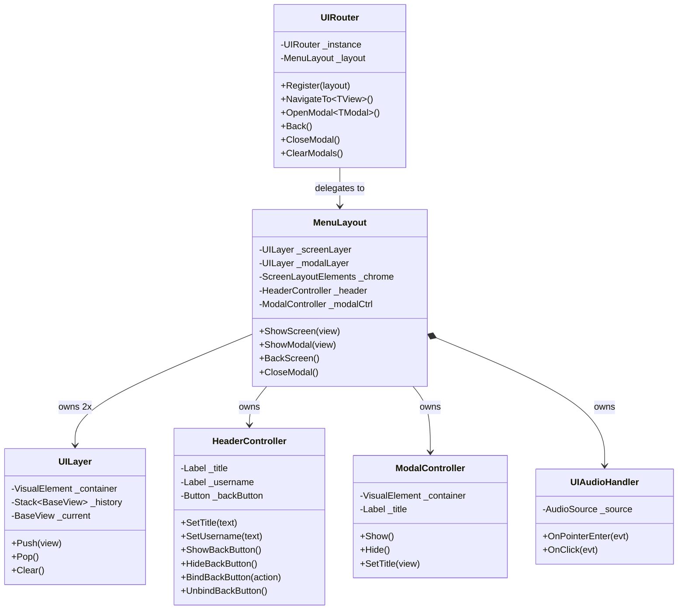

### View Hierarchy

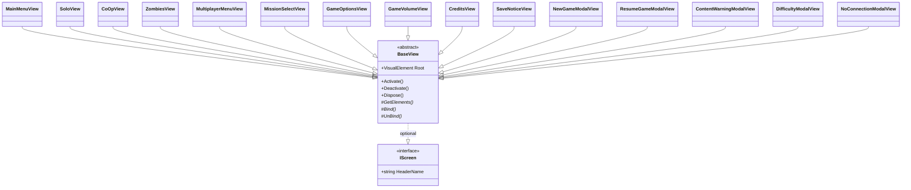

### Factory & Records

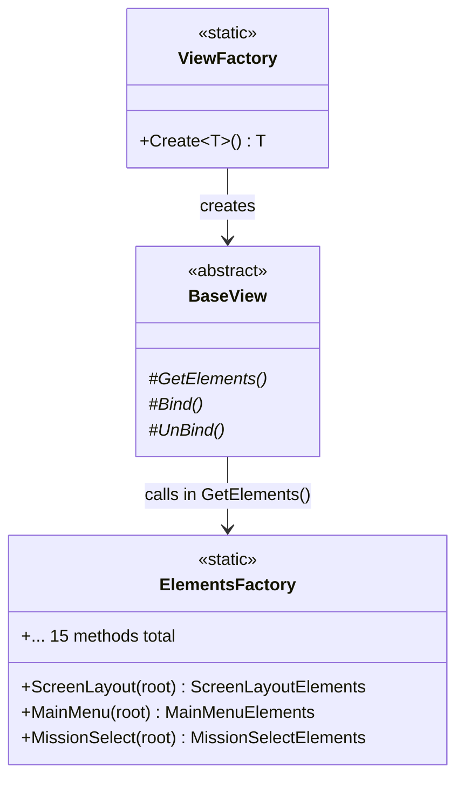

### Data Layer

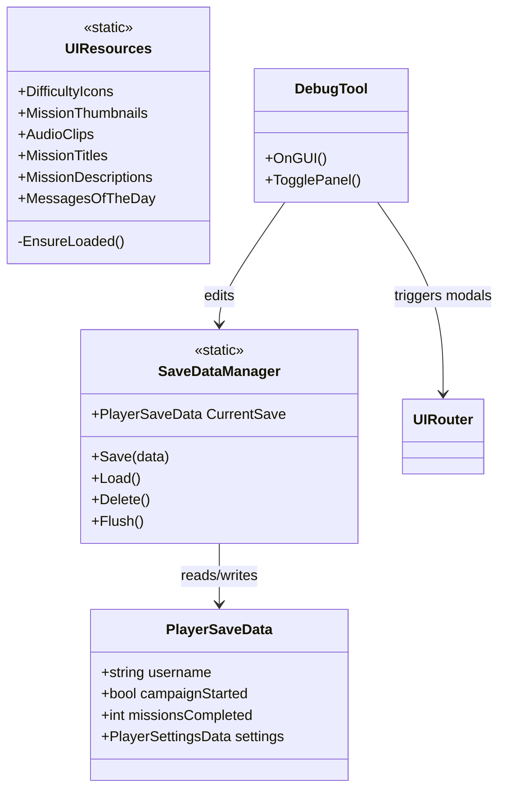

---

## Navigation Flow

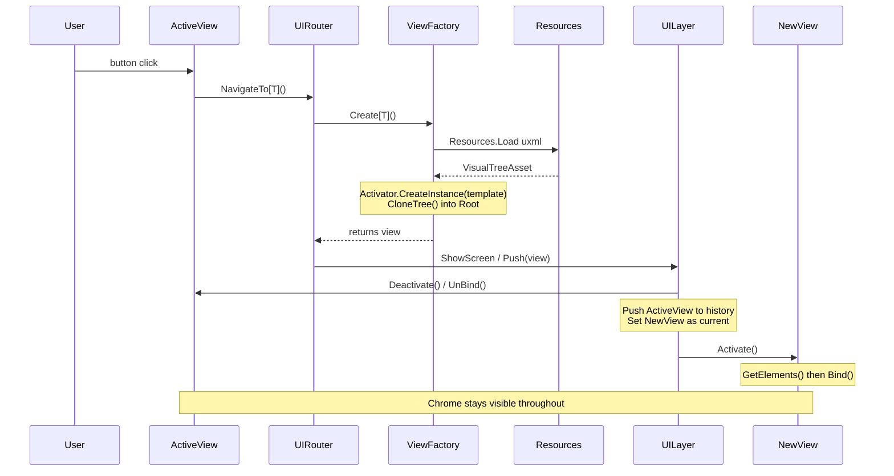

---

## Layer Stack States

### Screen Layer

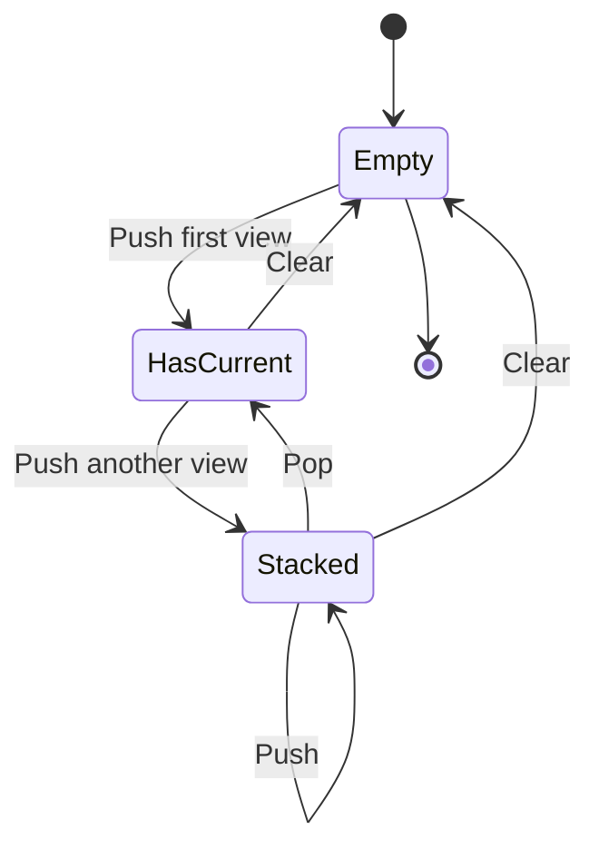

### Modal Layer

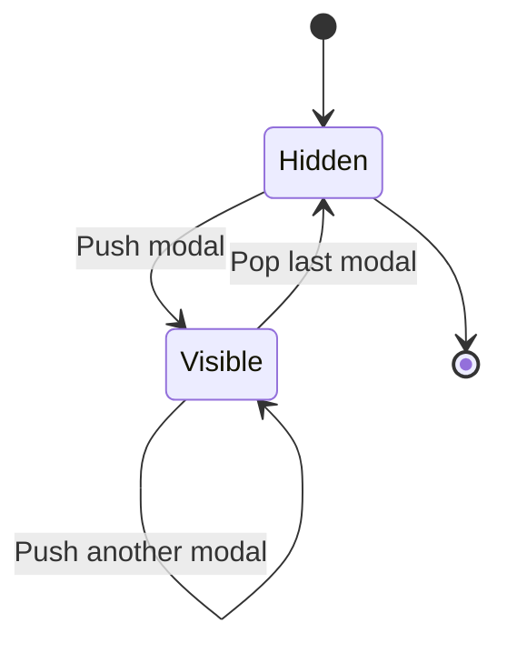

---

## Screen Navigation Map

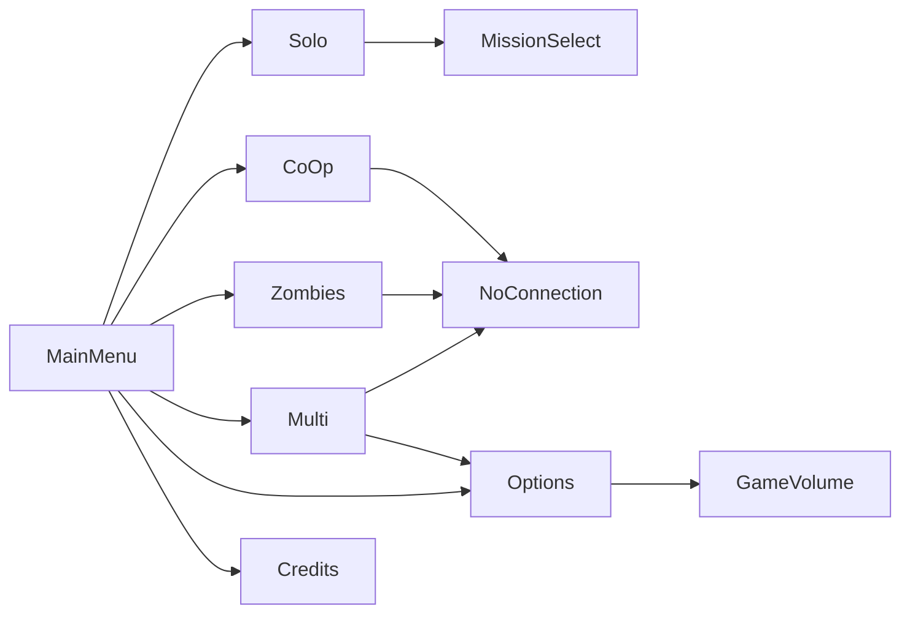

### Modal Triggers

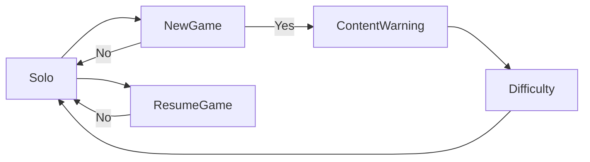

---

## Modal Chain (New Game Flow)

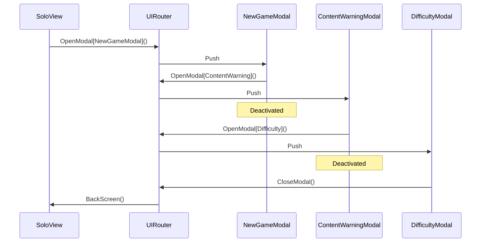

---

## Elements Records Pattern

```mermaid
flowchart LR
    subgraph UXML["UXML Document"]
        A1["Button name='solo-btn'"]
        A2["Button name='coop-btn'"]
        A3["Label name='motd-content'"]
    end

    subgraph Constants["Constants/Elements.cs"]
        B1["const SoloBtn = 'solo-btn'"]
        B2["const CoopBtn = 'coop-btn'"]
        B3["const MotdContent = 'motd-content'"]
    end

    subgraph Factory["ElementsFactory"]
        C1["root.Q<Button>(SoloBtn)"]
        C2["root.Q<Button>(CoopBtn)"]
        C3["root.Q<Label>(MotdContent)"]
    end

    subgraph Record["sealed record MainMenuElements"]
        D1["Button SoloButton"]
        D2["Button CoOpButton"]
        D3["Label MessageLabel"]
    end

    subgraph View["View.Bind()"]
        E1["SoloButton.clicked += HandleSolo"]
        E2["MessageLabel.text = FetchMOTD()"]
    end

    UXML -->|name attrs match| Constants
    Constants -->|queried by| Factory
    Factory -->|returns| Record
    Record -->|consumed by| View
```

---

## Data Flow

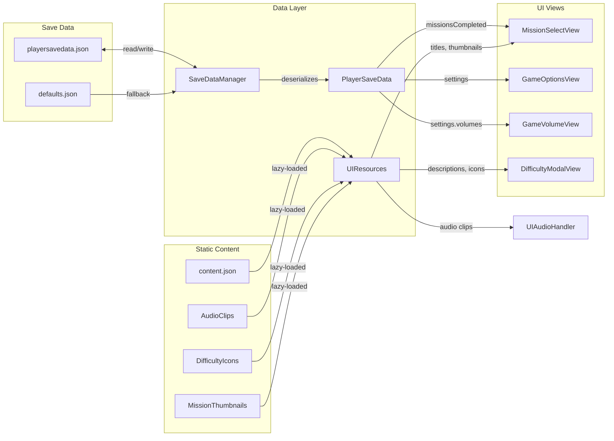

---

## View Lifecycle

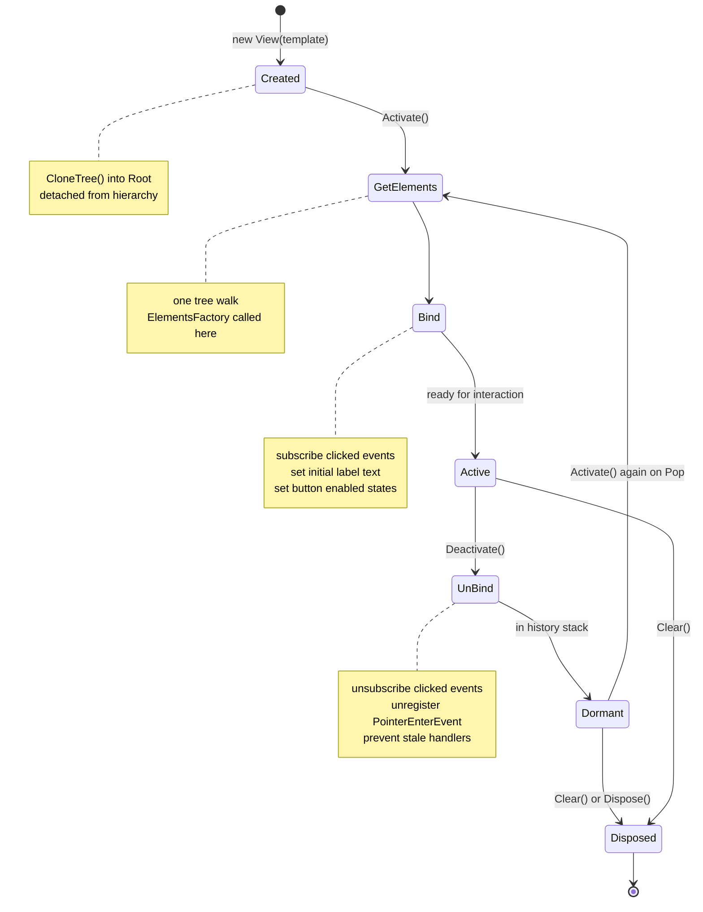

---

## Debug Tool

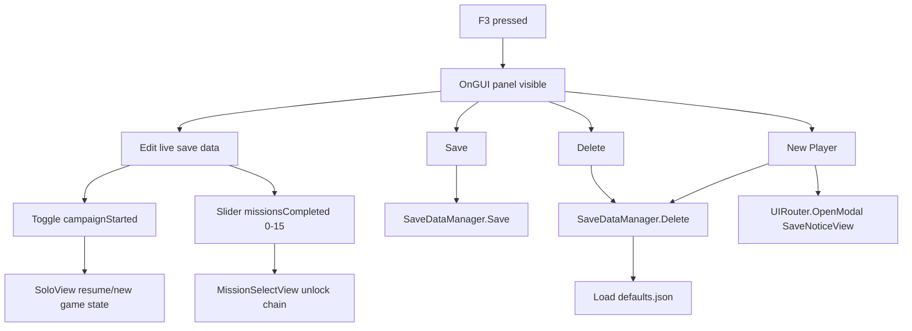

---

## Mission Select

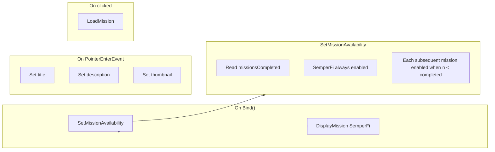

---

## Assembly Map

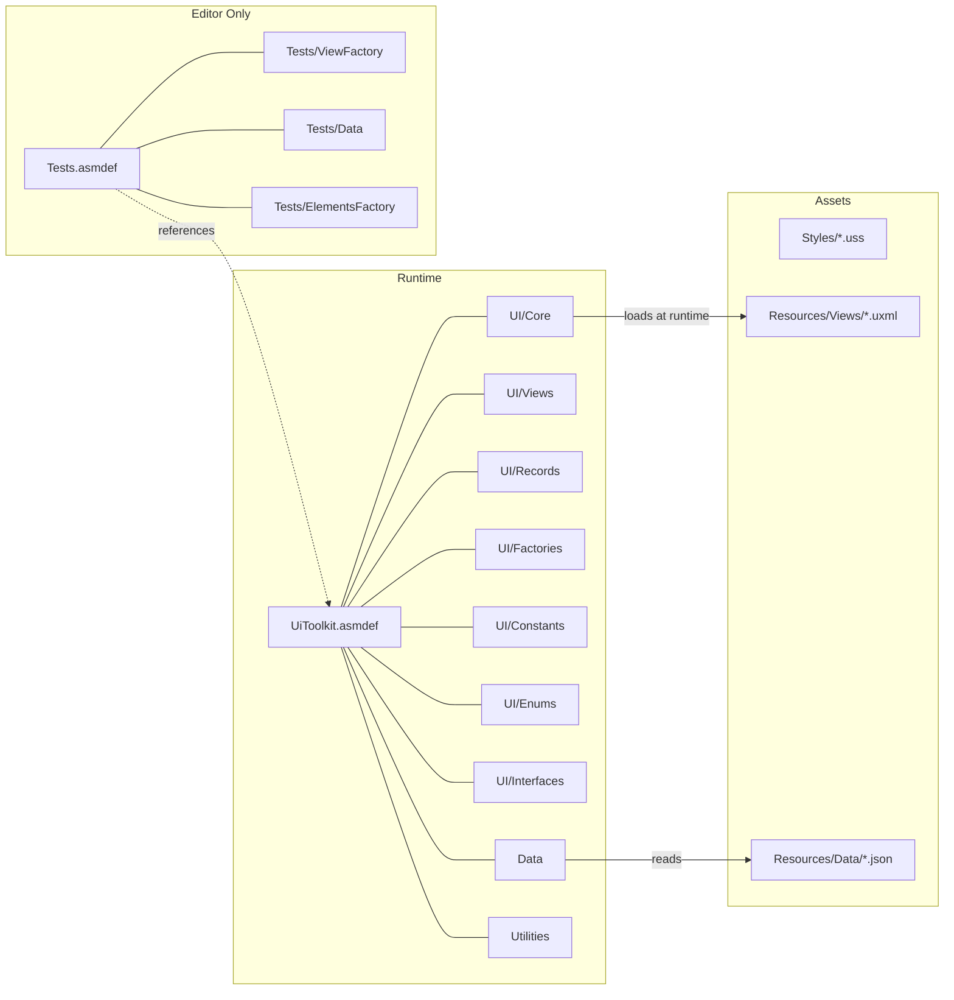

---

## USS Theming Chain

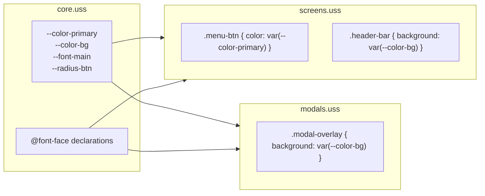

---

> All diagrams use Mermaid syntax. Render in any Mermaid-compatible viewer — GitHub, GitLab, Notion, Obsidian, or the [Mermaid Live Editor](https://mermaid.live).
