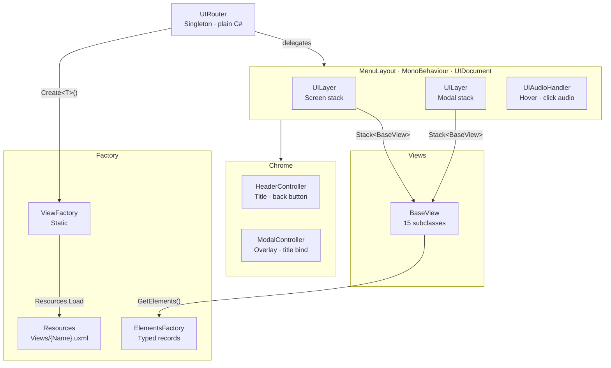
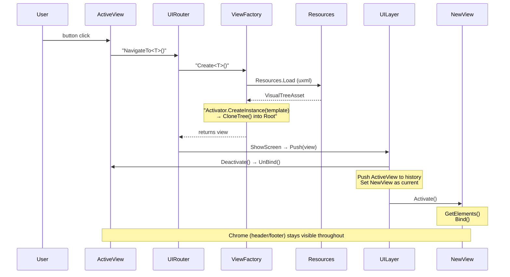
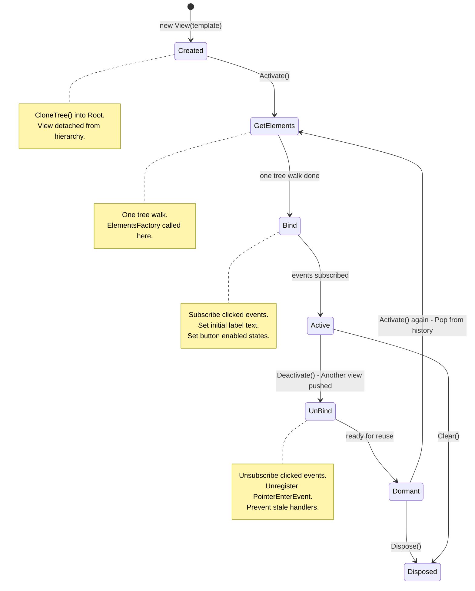

# Technical Breakdown

A deep dive into the architecture, features, and design choices behind the menu system. Companion to the [Quick Start](./QUICK_START.md) guide.

## Architecture

Core navigation architecture

Navigation flow sequence

View lifecycle state machine

---

## Features

### Navigation & Routing

**Convention-Based Navigation System:** `UIRouter` is a plain C# singleton where `NavigateTo<T>()` uses the C# type as the destination identifier. No enums, no switch statements, no inspector mappings, no string lookups.

**Zero-Registration Architecture:** A new screen equals two files, `.cs` and `.uxml`. No enum entries to add, no switch cases to extend, no registration calls to write, no ScriptableObjects to assign.

**Convention-Based ViewFactory:** `ViewFactory.Create<T>()` loads `Resources/Views/{TypeName}.uxml` by convention. The class name is the file path. If the UXML doesn't exist, an immediate `Debug.LogError` fires before a null-ref can occur.

**Dual UILayer Stacks:** Two independent `Stack<BaseView>` instances: one for screens, one for modals. Each manages its own lifecycle. Push deactivates the current view and stores it in history. Pop restores the previous view. The two stacks are independent of each other, so modals can stack over any screen without affecting screen state.

**Modal Overlay System:** `ModalController` manages a dedicated `VisualElement` container positioned absolute over the screen area. When no modal is active, the overlay is invisible and input passes through to the screen below. When a modal pushes, opacity goes to 1 and `pickingMode` activates, blocking interaction with the view underneath.

---

### UI Layer Architecture

**Typed Elements Records Pattern:** Every view's `GetElements()` is a single call to `ElementsFactory`, which returns a `sealed record` of strongly-typed `VisualElement` references. 16 records decouple UXML structure from C# logic. Element names live in `Constants/Elements.cs`, not scattered as magic strings across views. C# 9 positional records give immutability, value equality, and zero boilerplate per record.

**Element-Name-to-Constant Integrity:** All UXML element `name` attributes are centralized in `Constants/Elements.cs`. Every `ElementsFactory` method and every USS selector references these constants.

**Persistent Chrome Shell:** The header bar (title, username), footer bar (back button, version), and modal overlay container live outside both stacks. They survive every screen push/pop without ever being deactivated. The back button is bound once by `MenuLayout` and always calls `UIRouter.Instance.Back()`, regardless of which view is active. Views don't own or know about the chrome.

**IScreen Interface for Chrome Binding:** The `IScreen` interface is implemented by any view that needs a chrome title. `HeaderController` and `ModalController` use pattern matching against `IScreen` to set header text without concrete type checks or per-view switch statements.

**Complete View Lifecycle Contract:** `BaseView` defines four phases:

- Constructor: clones the UXML once
- `Activate()` -> `GetElements()` (one tree walk) + `Bind()` (subscribe events)
- `Deactivate()` -> `UnBind()` (unsubscribe)
- `Dispose()`: full cleanup, removes from hierarchy

The split between element querying (expensive but one-shot) and event binding (cheap but must be undone) prevents stale handlers and ensures clean teardown.

---

### Styling & Data

**USS Custom Property Theming:** `core.uss` defines a `:root` block of CSS custom properties for all colours, fonts, border radii, and motion values. `screens.uss` and `modals.uss` inherit these tokens. Changing a single variable in `core.uss` propagates to every panel. Theme-wide changes require edits to one file, not per-panel hunting.

**C# 9 Records on .NET Standard 2.1:** `IsExternalInit.cs` polyfill enables sealed positional records in Unity's .NET Standard 2.1 runtime. The entire Elements Records pattern depends on this. Without it, every record would require explicit constructor and property boilerplate.

**USS-Class-Driven Audio:** `UIAudioHandler` listens for `PointerEnterEvent` and `ClickEvent` at the root level. It checks the target element for `audio--hover` or `audio--click` USS classes. Audio assignment happens in UXML/USS. No C# event wiring per button.

---

### Content & Interactions

**Mission Select with Progressive Unlock:** 15-mission select screen driven by `SaveDataManager.CurrentSave.missionsCompleted`. Each button enables when `n < completed`. Hover over any enabled mission button populates a preview panel from `UIResources` dictionaries. The `PointerEnterEvent` registration and unregistration pattern shows proper event lifecycle hygiene across 30 handlers (15 hover + 15 click).

 

 

**Runtime Debug Tool:** F3-toggled `OnGUI` panel attached by `MenuLayout` at startup. Edits `campaignStarted` and `missionsCompleted` on the live save data. Buttons: Save (write JSON), Delete (remove save + reload defaults), New Player (delete + open `SaveNoticeView` modal). Proves the modal system, save-data round-trip, and mission unlock logic work without needing a game loop.

---

## Design Choices

### The Core Idea

It is a very opinionated system due to it being designed for scale and not like anything I have come across for Unity before. In many ways I am fighting against what Unity want to do. In my experience, once you scale up past a small game, having to manage endless inspector references and scriptable object references becomes a nightmare and kills your workflow.

The goal is to keep it entirely in code so programmers can handle the backend, while designers can freely modify the UXML Documents in UI Builder. No need to worry about references, instead there are just strictly defined naming conventions. The tests exist to help verify these so nothing silently fails if mislabelled.

### Boilerplate Code

UI Toolkit is a very fragile system due to everything running off of string queries. I think the Constants, Records and Factory classes are non negotiable. Due to the elements themselves requiring manual binding and unbinding, I believe it is better for each element to have its own unique function instead of putting everything in an array and just iterating through it blindly. If an error occurs, you can immediately go to the exact function and cause.

I value Safety, Scanability, Readability and Separation of Concerns above all else. This means that you will end up with some large views that might look verbose. MissionSelectView for example where each of the 15 buttons are uniquely named and have their own binding and unbinding functions, but once the initial boilerplate is done, working with it is much better than using Button[i] and trying to debug which one isn't working.

### No MVVM or Full DI

It is incredibly easy to get carried away trying to replicate common UI Architecture and Dependency Injection in a large UI Toolkit based system. I think the reality is just that the library isn't developed enough to handle this well, there's no built-in navigation, DI, or view locator. So attempting full MVVM/DI patterns from Web, WPF or Avalonia leads to more overhead than it is worth. You'll end up with a verbose code base where trying to add new views becomes a nightmare of touching 8-9 classes.

The system navigation running off of a UI Router singleton is a necessary evil. It is not modelled off of the cliche nightmare fat controller of old Unity Systems that has been phased out for more Scriptable Object based architecture. Instead, it is based off of the Unreal Engine 5 Subsystems which exist for these exact cases. On a fully developed game I would just fold this into a Service Locator that contains other static classes and singletons.
